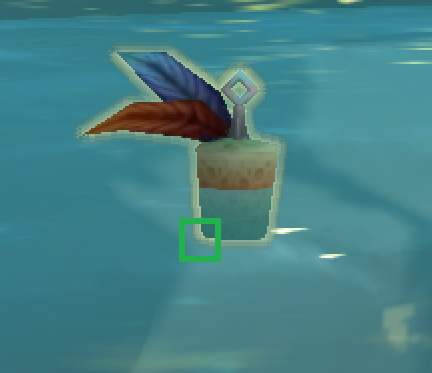
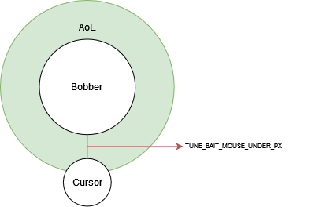

# Simple Fishing Bot for World of Warcraft

This fishing bot consists only of about 50 lines of code, it incorporates the mechanics of World of Warcraft and some simple Windows API Calls. 


## Overview

The bot has about ~99% success rate, there are some extremely rare cases where the bot won't catch it and I will explain why later. The method that the bot is using, should 
work in almost any fishing scenario in the game, I would personally avoid crowded places. The testing has been done in the current expansion (Shadowlands).

The bot is running on the currently Active Window, I haven't performed checks wether this is the window of the game or not. It waits for about 2 seconds before it starts.

### Metrics

```
Zereth Mortis: 29m 33s
Items Looted: 161
```

That means that we loot roughly about ~5.4 fish per minute.

## Installation & Usage

Check the `requirements.txt`, for the Python Requirements and install them via `pip install -r requirements.txt`. The tests are done under Python3.10 however I believe everything should work with Python>=3.6.

### Set the bait

Before using the bot, you need to supply it with an image of the bait. The image has to be on the bottom parts of the bait. Here is an example image, the green area indicates what would be a good image of the bait, it needs to be as small as possible.



Save the image and place it at the root of the script as `bait.png`, additionally you can adjust the variable `BAIT_IMAGE` in the [fishingbot](./fishingbot.py).

> ⚠️ It is important for you to take the photo because of the graphical/display settings which can be different for each computer.

### Fine-tune the script

The fine tunning that you have to do consists of:

```python
FISHING_BUTTON = "b"
TUNE_BAIT_MOUSE_UNDER_PX = 35
EDGE_RESET = 10, 10
ACTIVE_AFTER = 2
CONFIDENCE = 0.7
```

| Variable | Description |
|--- |---
| FISHING_BUTTON | The button that you use for fishing, in my case it was `b` |
| TUNE_BAIT_MOUSE_UNDER_PX | The offset pixels where the mouse is going to be whenever there is a bait, see the [How it works?](#how-it-works) section |
| EDGE_RESET | Those are the `x, y` coordinates to reset the mouse after catching the fish, it is used to improve the success rate, leave it at `10, 10` |
| ACTIVE_AFTER | The bot simply waits 2 secs before it starts |
| CONFIDENCE | The confidence of the template matching |

## How it works?

The method is extremely simple, it utilizes two things. The first one is the [Template Matching](https://docs.opencv.org/4.x/d4/dc6/tutorial_py_template_matching.html), this is what `pyautogui.locateOnScreen` uses under the hood and the second one is the [PyGetCursorInfo](https://github.com/mhammond/pywin32/blob/c08c3d9e4a503b195c312b0fbd51454bd2ee665a/win32/src/win32gui.i#L2486) function which is exposed by the `win32gui` lib.

The solution lies in the gif from the beginning, whenever the bobber actually catches a fish the AoE (Area of Effect) for the bobber becomes bigger allowing us to detect a change on the cursor, then we use the `GetCursorInfo` to catch the change of the cursor and if it becomes a different `tuple` from the default one which we set when there is nothing active on our cursor. Then we execute the click.

Now about the fine-tuning, look at this example



The `TUNE_BAIT_MOUSE_UNDER_PX` variable which doesn't have the best name ever is indicated with red, in simple terms it is how many pixels under the located bobber to place the mouse. For myself the range between 28-32 works the best, but as I said earlier this could differ.

## Additional features

I've added a bit of randomness in the timings between each press of the fishing and the click of the bobber with additionally pressing space every now and then. Apparently the server can detect that something fishy is going on when this randomness is removed.